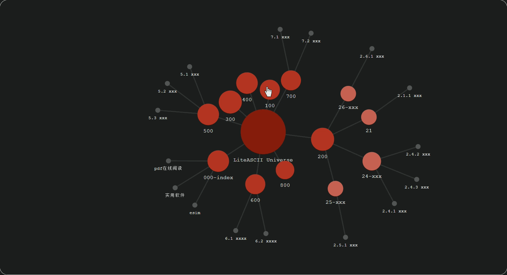

[中文](./README.zh.md) | English

# LiteASCII

A static site template specifically designed for  **Obsidian Knowledge Bases** . Featuring a minimalist Red & Black aesthetic, it integrates ASCII animations, Obsidian-style relationship and folder graphs, and full-text search.

Built with  **Astro 5 · Svelte 5 · Tailwind CSS v4** .

Build output is located in the `dist/` directory. A live demo is deployed on  **Vercel** : [LiteASCII Demo Site](https://lite-ascii.vercel.app)

---

## ✨ Features

### 1. 🎬 **ASCII Animations**

Supports TypeWriter terminal animations and WebGL-based ASCII video rendering.


### 2. 🔗 **Obsidian Knowledge Graph**

Visualizes directory-note structures and note-to-note reference relationships.



### 3. 📝 **Obsidian Compatibility**

Currently supports standard Obsidian Markdown internal link types and Markdown-format image paths.

### 4. 🏷️ **Category & Tag System**

Automatically aggregates and displays categories and tags based on note metadata.

### 5. 🔍 **Full-Text Search**

High-performance static full-text search powered by Pagefind.

---

## 🚀 Quick Start

### Prerequisites

* Node.js 18+
* pnpm

### Installation

**Bash**

```
# Clone the project
git clone https://github.com/tech-MeLD/LiteASCII.git
cd LiteASCII

# Install dependencies
pnpm install

# Start development server
pnpm dev
```

Visit `http://localhost:xxxx` to view your site.

### Build

**Bash**

```
# Build production version (includes search indexing)
pnpm build

# Preview the build locally
pnpm preview
```

### Clear Vite Build Cache (PowerShell)

**PowerShell**

```
if (Test-Path node_modules\.vite) { Remove-Item -Recurse -Force node_modules\.vite }; if (Test-Path .astro) { Remove-Item -Recurse -Force .astro };
```

---

## 📁 Project Structure

**Plaintext**

```
LiteASCII/
├── src/
│   ├── components/        # Components
│   │   ├── ascii/         # ASCII animation components
│   │   ├── features/      # Functional components (cards, nav, etc.)
│   │   ├── graph/         # Graph visualization components
│   │   ├── layout/        # Layout building blocks
│   │   └── ui/            # Basic UI components
│   ├── content/           # Your Obsidian notes
│   │   └── ...
│   ├── layouts/           # Astro layouts
│   ├── lib/               # Logic & Utilities
│   │   ├── core/          # Core site logic
│   │   ├── hooks/         # Svelte hooks
│   │   └── utils/         # Helper functions
│   ├── pages/             # Page routes
│   ├── styles/            # Global styles (Tailwind v4)
│   ├── types/             # TypeScript definitions
│   └── config.ts          # Site configuration
├── public/                # Static assets
├── astro.config.mjs       # Astro configuration
├── tailwind.config.mjs    # Tailwind configuration
└── package.json
```

---

## 📝 Usage Guide

### Adding Notes

Simply place your Obsidian notes (Markdown files) into the `src/content/` directory. The template currently supports the following Frontmatter:

**YAML**

```
---
title: Note Title
date: 2026-01-01
tags: [tag1, tag2]
description: A short summary of the note
category: Folder/Category Name
---
```

### Images and Attachments

Place images in an `attachments/` folder at the same level as your notes, and reference them using standard Obsidian formats:

**Markdown**

```

```

### Internal Linking

Supports Obsidian-style internal references and attachment links:

**Markdown**

```
[Link to external doc](../000%Index/...)
[Link to internal section](#..)

```

### Site Configuration

Edit `src/config.ts` to customize your site information:

**TypeScript**

```
export const siteConfig = {
  title: 'LiteASCII',
  description: 'Explore the boundaries of knowledge, connect the stars of thought.',
  author: 'Your Name',
  github: {
    username: 'your-github-id',
    repo: 'your-repository',
  },
  navLinks: [
    { name: 'Home', href: '/' },
    { name: 'Notes', href: '/notes' },
    // ...
  ],
}
```

---

## 🎨 Customizing the Theme

Theme colors are defined in `src/styles/tokens.css`:

**CSS**

```
:root {
  --color-primary: #e74c3c;        /* Primary Accent (Red) */
  --color-bg: #161618;             /* Background (Dark) */
  --color-text: #e8e8e6;           /* Main Text */
  --color-border: #303032;         /* Borders */
  /* ... */
}
```

---

## 🔧 Advanced Configuration

### Custom Slug Rules

You can modify URL slug generation rules in `astro.config.mjs` and `src/lib/core/note-logic.ts`.

### Switching ASCII Animations

Edit `src/components/features/AsciiArt.svelte` to toggle between animation styles:

**TypeScript**

```
// Typewriter effect
import Animation from '../ascii/TypeWriter.svelte';

// WebGL ASCII Color effect
import Animation from '../ascii/WebGLASCII_color.svelte';
```

---

## 🌐 Deployment

### Static Hosting

The build output in `dist/` can be deployed to any static hosting provider:

* [Vercel](https://vercel.com)
* [Netlify](https://netlify.com)
* [GitHub Pages](https://pages.github.com)
* [Cloudflare Pages](https://pages.cloudflare.com)

### Alibaba Cloud ESA

To deploy to Alibaba Cloud Edge Security Acceleration (ESA), you can configure a `GitHubAction`. Refer to the [eas-cli documentation](https://github.com/aliyun/alibabacloud-esa-cli) for details.

---

## 🤝 Contributing

Issues and Pull Requests are always welcome!

## 📄 License

This project is licensed under the [MIT](https://www.google.com/search?q=LICENSE) License.

---

> 🌟 If this project helped you, please give it a Star!
>
