# Python 起源

Python 的设计哲学：优雅、明确、简单
Python 语言是一种解释型、面向对象、动态数据类型的高级程序设计语言
Python 支持命令式编程（How to do）、函数式 编程（What to do），完全支持面向对象程序设计， 语法简洁清晰，拥有大量的几乎支持所有领域应用 开发的成熟扩展库

# Python 的发展与现状

- Redhat: 世界上最流行的 Linux 发行版本中的 yum 包管理工具就是用 python 开发的
- Instagram: 美国最大的图片分享社交网站，每天超过 3 千万张照片被分享，全部用 python 开发
- YouTube: 世界上最大的视频网站 YouTube 就是用 Python 开发的
- NASA: 美国航天局 (NASA) 大量使用 Python 进行数据分析和运算
- 知乎: 国内最大的问答社区，通过 Python 开发 (国外 Quora)
- 豆瓣: 公司几乎所有的业务均是通过 Python 开发的
- 除上面之外，还有搜狐、金山、腾讯、盛大、网易、百度、阿里、淘宝、土豆、新浪、果壳等公司都在使用 Python 完成各种各样的任务。

# Python 优点

- 底层以及很多标准库是用 C 语言写的，规范的代码免费开源高级语言优点可移植性解释性面向对象运行速度非常快。
- 高级语言编程时候无需考虑程序使用的内存一类的底层细节。
- Python 已经被移植在许多平台上丰富的类库可嵌入性可扩展性 （Linux、Windows 等）
- Python 语言写的程序不需要编译成二进制代码，直接从源代码运行程序
- Python 采用强制缩进的方式使得代码具有较好可读性
- Python 标准库强大，如正则表达式、电子邮件、图像库之类。被称为“胶水语言”，能够联结其他语言的各种模块（尤其是 C/C++）
- 
## 一、优雅、简单、明确

入门简单，深入进去后可以开发出功能强大的程序。

```c
#include<stdio.h>
main()
{
	printf("hello world!");
}
```

```python
print('hello world')
```

## 二、良好的可扩展性

Python 有大量的第三方模块，覆盖了科学计算、Web 开发、数据接口、图形系统等众多领域，开发的代码通过很好的封装，也可以作为第三方模块给别人使用。如 Pandas、Numpy、 Seaborn、Scikit-learn 等等

## 三、Python 具有丰富和强大的库

Python 常被昵称为胶水语言，能够把用其他语言制作的各种模块（尤其是 C/C++）很轻松地联结在一起，满足不同应用领域的需求。
比如我们要做一个考勤系统， 人脸识别算法用 C++ 语言编写， 考勤的管理是 python 编写，就可 以将 C++ 整块移动到 python 中。

# Python 的应用

- 系统编程：提供 API，方便系统维护和管理。
- 图形处理：有 PIL、Tkinter 等图形库支持，有利于图像处理。
- 数学处理：NumPy 扩展提供大量与许多标准数学库的接口。
- 文本处理：re 模块能支持正则表达式，还提供 SGML，XML 分析模块，许多程序员利用 python 进行 XML 程序的开发。
- 数据库编程：程序员可通过遵循 PythonDB-API（数据库应用程序编程接口）规范的模块与 MicrosoftSQLServer，Oracle，Sybase，DB2，MySQL、SQLite 等数据库通信。python 自带有一个 Gadfly 模块，提供了一个完整的 SQL 环境。
- 网络编程：提供丰富的模块支持 sockets 编程，能方便快速地开发分布式应用程序。很多大规模软件开发计划例如 Zope，Mnet 及 BitTorrent.Google 都在广泛地使用它网络编程：提供丰富的模块支持 sockets 编程，能方便快速地开发分布式应用程序。很多大规模软件开发计划例如 Zope，Mnet 及 BitTorrent.Google 都在广泛地使用它。
- Web 编程：应用的开发语言，支持最新的 XML 技术。
- 多媒体应用：PyOpenGL 模块封装了“OpenGL 应用程序编程接口”，能进行二维和三维图像处理。 PyGame 模块可用于编写游戏软件。
- 黑客编程：python 有一个 hack 的库，内置了你熟悉的或不熟悉的函数，但是缺少成就感。

## Python 的应用场景

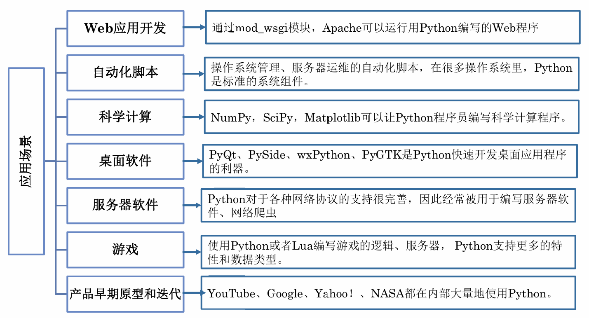

## Python 的应用方向


# Python 的开发环境

## Python 的版本发展

Python 2.x 系列已于 2020 年全面放弃维护和更新
Python 也因此分为了 Python 3.5 派系和 Python 2.7 派系两大阵营
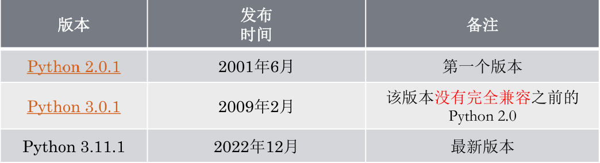

## Python shell

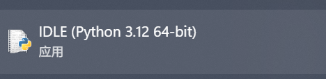

# Python 的编程特点与规范

## Python 的特点

1、Python 使用 C 语言开发，但是 Python 不再有 C 语言中的指针等复杂的数据类型。
2、Python 具有很强的面向对象特性，而且简化了**面向对象**的实现。它消除了保护类型、抽象类、接口等面向对象的元素。
3、Python 仅有 **33 个保留字**，而且没有分号、begin、end 等标记。

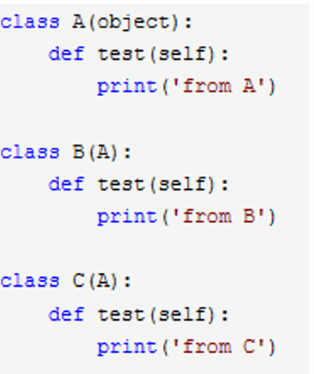

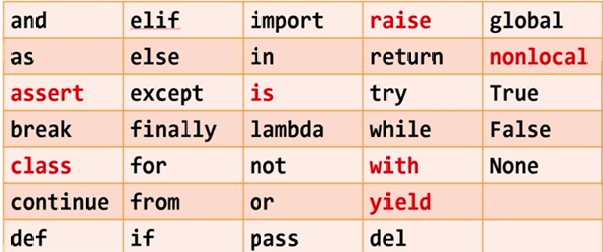

## 动态数据类型

- Python 定义对象的方法很简单，**无须预先的声明语句，也没有必要指定值的类型**
- Python 使用“动态类型”机制，只要需要，某个对象引用都可以重新引用到不同的对象。

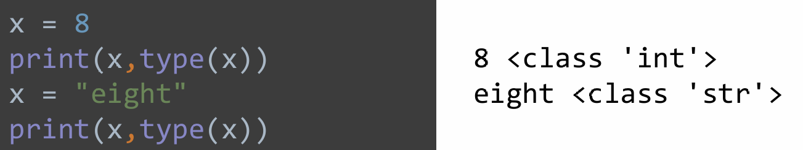

## 标识符命名规则

- 文件名、类名、模块名、变量名及函数名等标识符的第一个字符必须是字母表中字母或下划线 `'_'。`
- 标识符的其他的部分由字母、数字和下划线组成，且标识符对**大小写字母**敏感。
- 关键字不能用于命名变量，如 and、as、assert、break、class、 continue、def、del 等

## 代码缩进

Python 程序是依靠代码块的缩进来体现代码之间的逻辑关系的。

- 一般以 4 个空格或制表符（按 Tab 键) 为基本缩进单位。
- 缩进量相同的一组语句，称为一个语句块或程序段。
- 同一个级别的代码块的缩进量必须相同。
- 注意：空格的缩进方式与制表符的缩进方式不能混用。

## 程序中的注释语句

- 单行注释以“#” 符号和一个空格开头。如果在语句行内注释（即语句与注释同在一行），注释语句符与语句之间至少要用两个空格分开。
- 多行注释用三个单引号 ''' 或者三个双引号 """ 将注释括起来

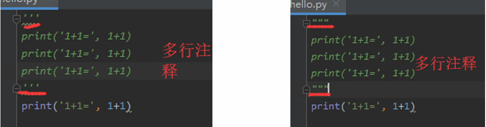

## 代码过长的折行处理

当一行代码较长，需要折行（换行）时，可以使用反斜杠’\’延续行。

例如：
```python
io3 = can.create_oval(65,70,185,170, outline='yellow', fill='yellow')
```

可以写成：

```python
io = can.create_oval(65,70,185,170,\
outline='yellow',\
fill='yellow')
```

# 简单数据类型

## 一、变量与常量

### Python 的数据类型

Python 定义了 6 组标准数据类型：
- Number 数字
- String 字符串
- List 列表
- Tuple 元组
- Sets 集合
- Dictionay 字典

### 变量

python 定义变量的语法为：variableName = value，如：
`a = 3 `
`s = “hello world”`
- 注意：同一变量可以反复赋值，而且可以是不同类型的变量

```python
x=8
print(x,type(x))	#type()函数用于查看对象的数据类型
x="eight"
print(x,type(x))
```

### 常量

常量表示“不能变”的量
Python 中是没有常量的关键字的，只是我们常常约定使用大写字母组合的变量名表示常量，也有不要对其进行赋值的提醒作用。

```python
PI = 3.14
```

## 二、数值类型

### 整数 int

- 与数学中整数的概念一致，整数可正可负
- 整数的大小受限于机器内存的大小

### 浮点类型 float

对于很大或很小的浮点数，必须用科学计数法表示，具体表示方式：把 10 用 e 替代。
如：1.23x109 可以写成 1.23e9，或者 12.3e8，0.000012 可以写成 1.2e-5

```python
a=1.2e9
a
b=1.2e-5
b
```

### 布尔型值

布尔值类型是一种特殊的数据类型，表示真（True）/假（False） 值，它们分别映射到整数 1 和 0。

### 复数

与数学中复数的概念一致 a+bj 被称为复数，其中：a 是实部，b 是虚部

z = 1 + 2j
- z.real 获得实部
- z.imag 获得虚部

- math 模块提供了许多对浮点数的数学运算函数;
- cmath 模块包含了一些用于复数运算的函数。

### 数值运算操作符

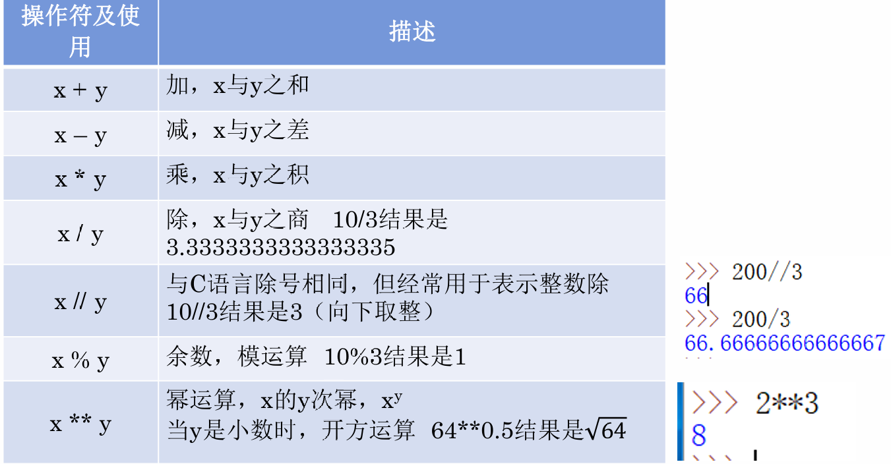

### 增强赋值操作符

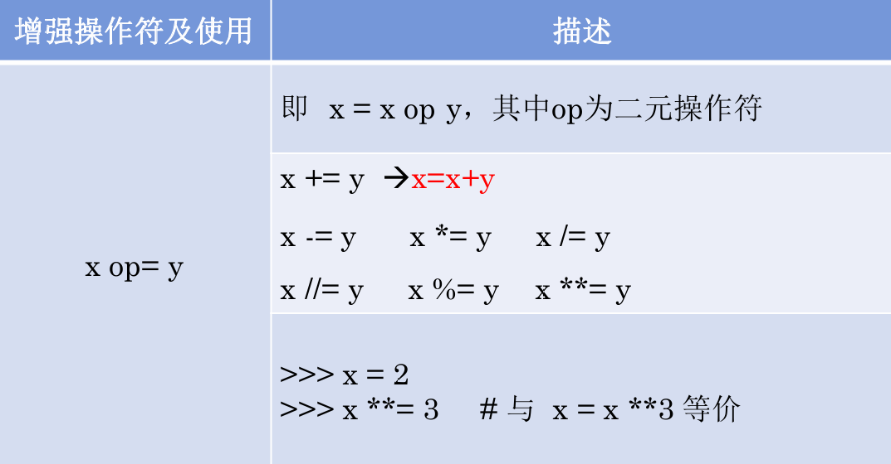

### 数值类型间的混合运算

- 类型间可进行混合运算，生成结果为 " 最宽 " 类型
- 三种类型存在一种逐渐 " 扩展 " 或 " 变宽 " 的关系：**整数 -> 浮点数 -> 复数**
- 例如：123 + 4.0 = 127.0 (整数 + 浮点数 -> 浮点数)

## 三、字符串

### 字符串的定义

由 0 个或多个字符组成的有序序列称为“字符串”。

### 字符串的表示

由一对**单引号**或**双引号**表示，仅表示单行字符串。例如：‘abcabc’、‘123’、“你好”都是字符串。

由一对**三单引号**或**三双引号**表示，可表示多行字符串。

```python
s = """hello 
world"""
```

如果希望在字符串中包含双引号或单引号呢？
`i'm a student`
`abc"de"`
- 字符串中是单引号，外部就用双引号；
- 字符串中是单引 号，外部就用双 引号；反之亦然

```python
print("i'm a student")
print('abc"de"')
```

如果希望在字符串中既包括单引号又包括双引号呢？

如：` ‘我’爱"Python"`
又如：` '我'爱'python' `

```python
print(''''我'爱Python"''')
print("\'我\'愛\"Python\"")
```

如果不想\作为转义字符，而是想输出\，那应该怎么做呢？
例如，我们要输出的字符串为 \'
- 当字符串中所有字符都需要按其字面意义理解时，可以在字符串前面加 r 引导

```python
print(r"\'")
```

### 转义符

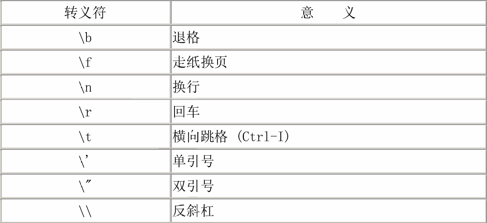


### 字符串分片与步距


### 字符串常见操作符

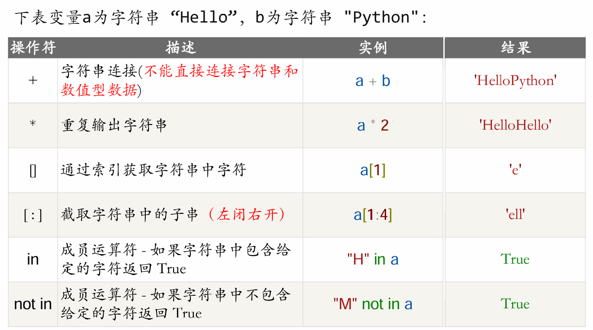

### 字符串常用内置函数

- `str ()`：str() 函数可以将数字对象、列表对象、元组等转换成字符串
- `len ()`：len() 函数返回字符串的长度
- `str.upper()`：将字符串中的小写字母转换为大写字母
- `str.lower()`：将字符串中的大写字母转换为小写字母
- `str.swapcase()`：将字符串中大写转换为 小写，小写转换为大写


- `str.strip()`：用于删除字符串头尾指定的字符（默认为空格）
- `str.lstrip()`：用于截掉字符串左边的空格或指定字符
- `str.rstrip()`：用于删除字符串字符串末尾的空格


- `str.split()`：通过指定分隔符对**字符串进行切片**
- `str.split(参数1, 参数2)`：参数 1：分隔符，参数 2：分割次数。返回值为分割后的**字符串列表**

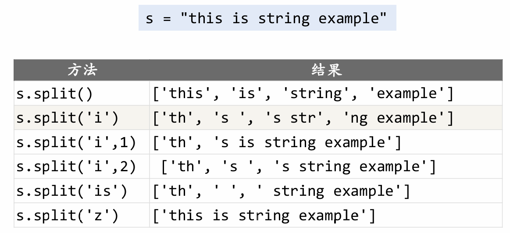

### 字符串常用方法


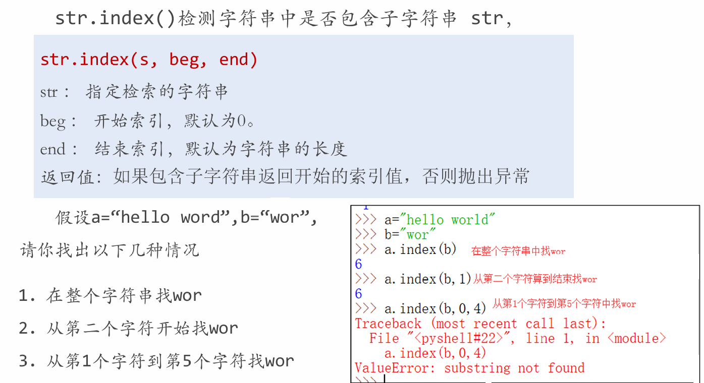

- `str.join (sequence)`：用于将序列中的元素以指定的字符连接生成一个新的字符串。
- `- sequence --` ：要连接的元素序列。

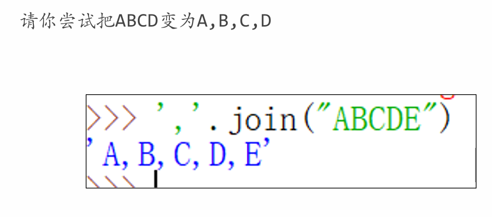

### 字符串格式化

- Python 中格式化字符串的方式和 C 一致，用% 实现
- 浮点数特别说明

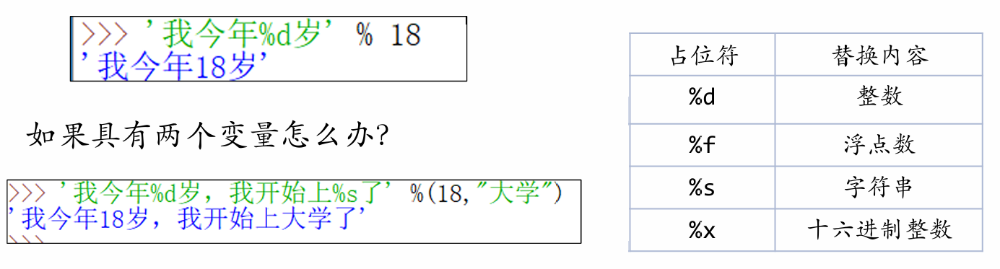

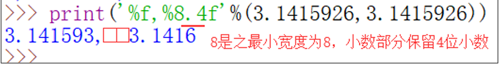

- fortmat() 方法会返回一个新字符串，在新字符串中，原字符串的替换字段被适当格式化后的参数所替代。


- 在 format() 中还可以使用“关键字参数”的方式，如：


- 在 format() 中“位置参数”可以与“关键字参数”混用，但要注意：关键字参数必须总在位置参数之后，否则报错。


### 数据类型占用内存空间

使用 `sys.getsizeof` 查看 python 对象的内存占用，单位：字节 (byte)


## 四、输入输出

### 输出语句

- 字符串、数值、列表、元组和字典等类型都可以用 print() 函数直接输出。
- `print()` 函数也可以接受多个字符串，用逗号“,”隔开，就可以连成一串输出：


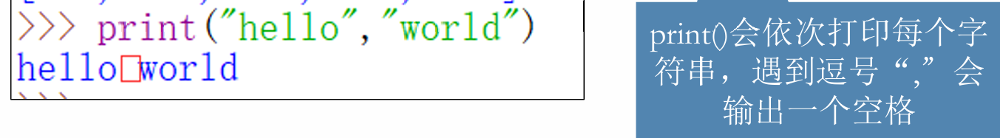

- `print()` 函数之 end

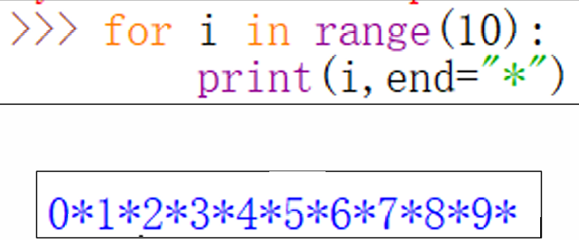

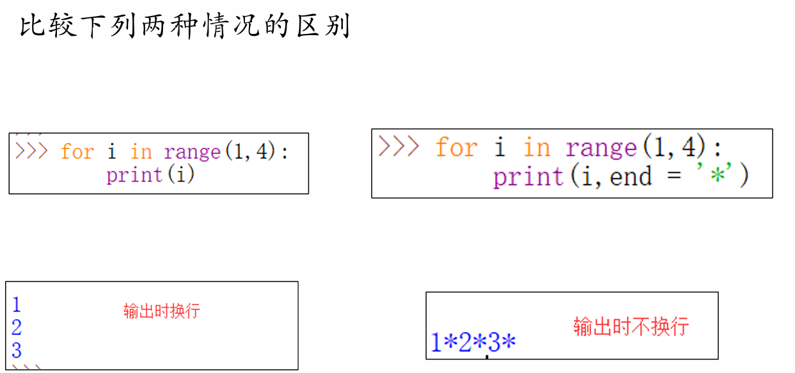

### 输入语句

`input()` 函数：输入文本类型


`input()` 函数：输入数值类型
- `input(`) 函数只能输入文本。
- 对于数值型的数据，需要使用 ` eval()` 函数将文本转换为数值。

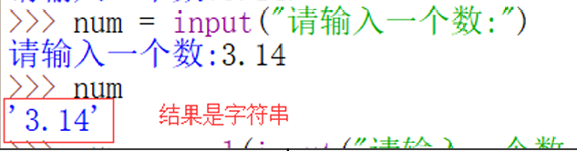

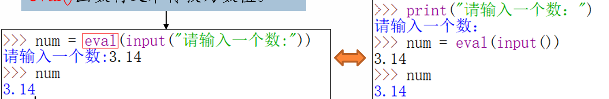

