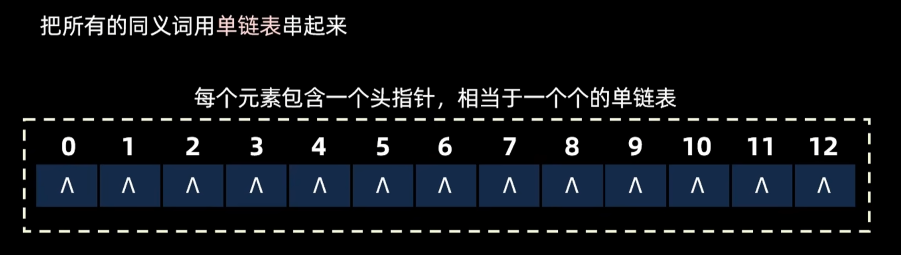

- **散列函数**
    - 直接定址法：用关键字的某个线性函数作为地址
		- 不会冲突，适合关键字分布连续的情况，否则会出现大量空间浪费
    - 数字分析法：分析关键字的数值特征
    - 平方取中法：取关键字平方后的中间几位
    - 除留余数法：常用，`h(key) = key mod p`
	    - 最常用，可以把关键字映射到连续的地址空间
	    - 可能会出现冲突，降低散列表的性能
	    - 影响散列表性能的因素：散列函数、装填因子、处理冲突的方法
	    - 插入、查找、删除 del、Null
- **冲突处理**
    - 开放定址法：线性探测、平方探测、双散列
	    - 线性探测
		    - 线性探测法往后找一直到空闲的地址，表尾的下一个位置是表首
		    - 缺点：容易出现聚集
	    - 平方探测法
		    - 优点：可以缓解堆积问题
		    - 缺点：不一定探测到所有散列表位置
		    - 研究表明：表长如果是某个 4 k+3 的质数（k 为正整数），那么一定可以探测到所有位置，所以表长一般设置成 4 k+3 的质数
    - 拉链法（链地址法）：把所有同义词用单链表串起来，同一地址的元素用链表存储
	    - 头插法、尾插法、可以直接删除值
    - 再散列法：冲突时换一个散列函数
    - 公共溢出区：冲突元素放到专门的溢出区
- **平均查找长度（ASL）**
    - 成功查找：找到元素所需的平均比较次数
    - 不成功查找：未找到元素时的平均比较次数
    - 与装填因子（α = 已填元素数 / 散列表长度）密切相关
- **重点**
    - 散列函数设计原则：简单、均匀、减少冲突
    - 各种冲突处理方法的效率对比
    - 冲突：冲突越多，散列表效率越低
    - 同义词：映射到同一位置的关键字
    - 影响冲突可能性：散列函数的选取、装填因子
    - 冲突会影响散列表的查找性能

